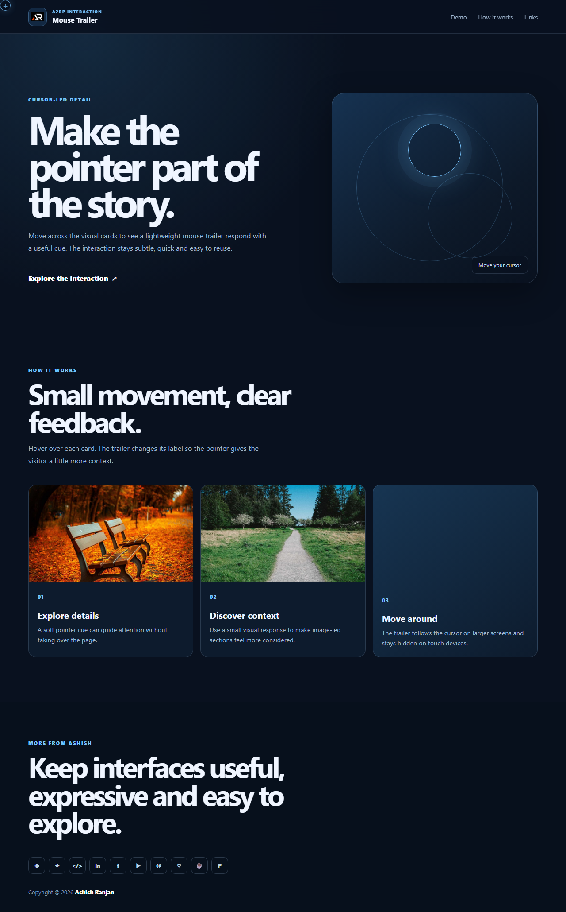

# Mouse Trailer

A small static interaction demo where a custom trailer follows the pointer and changes its cue when visitors hover over visual cards.

## Features

- Fixed branded header with local logo and mobile menu
- Pointer-following trailer with contextual hover labels
- Local image assets with responsive gallery cards
- Touch-device fallback that hides the pointer-only interaction
- Icon-only social and support footer links with dynamic copyright

## Tech stack

- HTML5
- CSS3
- Vanilla JavaScript

## Run locally

```bash
npx serve .
```

## Deploy

```powershell
New-Item -ItemType Directory -Force dist
Copy-Item index.html,script.js,style.css -Destination dist -Force
Copy-Item public -Destination dist -Recurse -Force
npm run deploy
```

## Screenshot



## Links

- Live: [https://a2rp.github.io/mouse_trailer_html_css_javascript/](https://a2rp.github.io/mouse_trailer_html_css_javascript/)
- Repository: [https://github.com/a2rp/mouse_trailer_html_css_javascript](https://github.com/a2rp/mouse_trailer_html_css_javascript)
- Portfolio: [https://www.ashishranjan.net/](https://www.ashishranjan.net/)
- GitHub: [https://github.com/a2rp](https://github.com/a2rp)
- CodePen: [https://codepen.io/ash1198](https://codepen.io/ash1198)
- LinkedIn: [https://www.linkedin.com/in/aashishranjan](https://www.linkedin.com/in/aashishranjan)
- Facebook: [https://www.facebook.com/theash.ashish/](https://www.facebook.com/theash.ashish/)
- YouTube: [https://www.youtube.com/@ashishranjan-ashz?sub_confirmation=1](https://www.youtube.com/@ashishranjan-ashz?sub_confirmation=1)
- Email: [ash.ranjan09@gmail.com](mailto:ash.ranjan09@gmail.com)

## Support

- Support: [https://a2rp-donation-page.netlify.app/](https://a2rp-donation-page.netlify.app/)
- Buy Me a Coffee: [https://buymeacoffee.com/a2rp](https://buymeacoffee.com/a2rp)
- Patreon: [https://patreon.com/a2rp](https://patreon.com/a2rp)